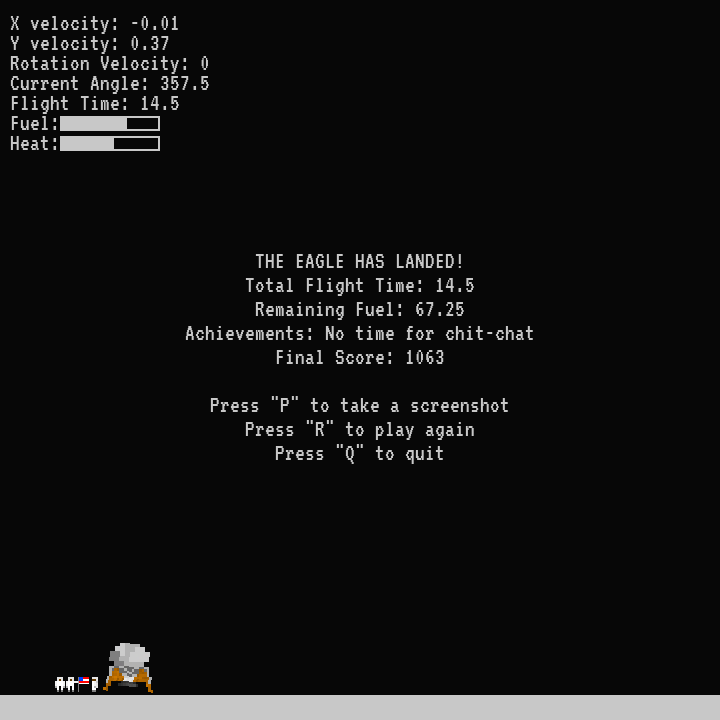

# LunarLanderGame
 A little Pygame to land the LEM on the Moon.

 

# Installation
1. Install Python version 3.8 or newer. You can download that directly from the [Python website](https://www.python.org/downloads/).
1. Clone this repository using `git clone migillett/LunarLanderGame` and `cd` into the directory.
1. Install dependencies using `pip install -r ./LunarLander/requirements.txt`

# Starting the Game
To start the game, simply run the LunarLander.py file using Python 3.8 or later. For example, you can run the following command from within the main repository directory:
```bash
python ./LunarLander/LunarLander.py
```
# Sprites and Assets
This project includes [sprites](https://opengameart.org/content/apollo-moon-landing-sprites), [sound effects](https://opengameart.org/content/8-bit-sound-fx), and [music](https://opengameart.org/content/8-bit-jupiter-the-bringer-of-jollity) created by [Dizzy Crow](https://opengameart.org/users/dizzy-crow) from the [OpenGameArt archive](https://opengameart.org/).

# To Do List
- Balance the scores a bit more based on difficulty
- Add in more landing sites that increase in difficulty and score mulipliers
- Add in lunar lander skins
- Lunar lander upgrades?
- Compile for Windows, Mac OS and Linux